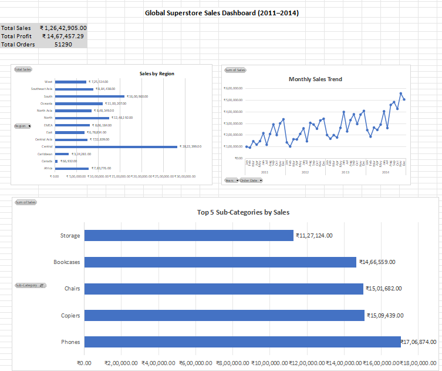

# 🧾 Global Superstore Sales Dashboard (Excel)

📊 This Excel dashboard analyzes 4 years of sales data from the Global Superstore dataset using PivotTables and charts.

## 📁 Dataset
- Source: Kaggle – Global Superstore
- Fields include: Order Date, Sales, Profit, Region, Sub-Category, and more.

## 🔍 Dashboard Features

| Metric                  | Description                                  |
|-------------------------|----------------------------------------------|
| ✅ Total Sales           | Sum of all sales across 4 years              |
| ✅ Total Profit          | Sum of profit across orders                  |
| ✅ Total Orders          | Count of distinct order IDs                  |
| 📊 Sales by Region       | Horizontal bar chart showing regional sales  |
| 📈 Monthly Sales Trend   | Line chart of sales performance by month     |
| 🏆 Top Sub-Categories    | Bar chart of top 5 selling sub-categories    |

## 📸 Preview

---

## 📌 Tools Used
- Microsoft Excel
- PivotTables & PivotCharts
- Currency formatting (₹)
- Basic dashboard design principles

---

## 🤝 Contributed by
**Aditya Khare**  
_ETL Developer & Aspiring Data Scientist_  
📧 adikhare0207@gmail.com  
